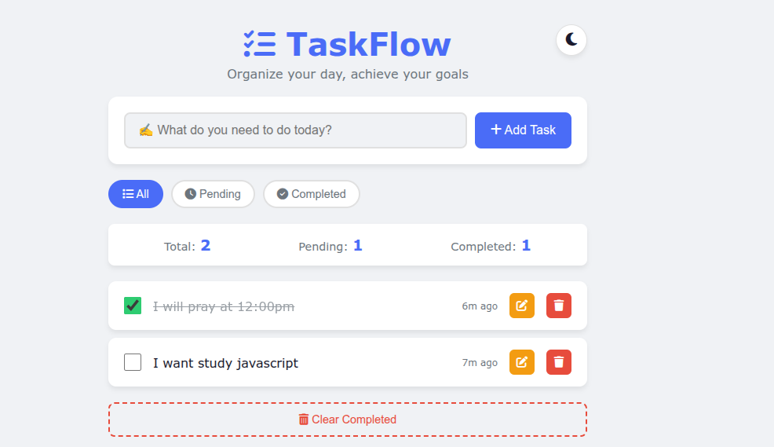

# TaskFlow - Interactive To-Do List

A beautiful, feature-rich task management app built with vanilla JavaScript.



## 🌟 Features

- Add, edit, delete tasks
-  Mark tasks as complete/incomplete
- Filter tasks (All, Pending, Completed)
- Dark/Light theme toggle
- Data persists in LocalStorage
- Duplicate task detection
- Task statistics dashboard
- Fully responsive design
- Smooth animations
- Keyboard support (Enter to add)

## 🛠️ Technologies Used

- HTML5
- CSS3 (Custom Properties, Flexbox, Animations)
- JavaScript (ES6+)
- LocalStorage API
- Font Awesome Icons

## 🚀 Live Demo

[View Live on GitHub Pages] (https://github.com/Dani2129/TaskFlow.git)

## 📦 How to Run Locally

1. Clone this repository:
   ```bash
   git clone https://github.com/Dani2129/TaskFlow.git